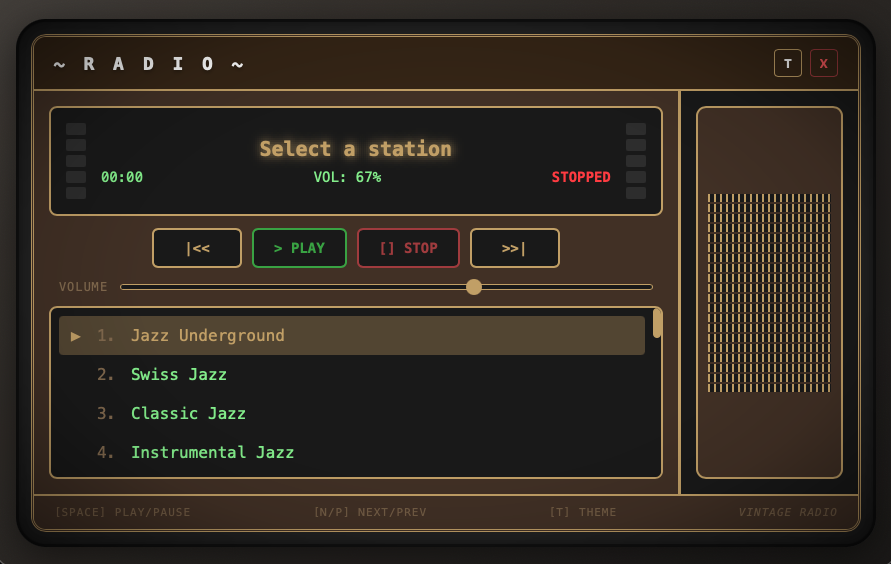

# Vintage Radio Desktop

A retro-style internet radio player with a beautiful vintage UI.

**Available for macOS, Linux, and Windows**



## Features

- **24 Pre-loaded Stations** — Jazz, Vintage, Funk & Groove, World Music
- **8 Beautiful Themes** — Bakelite, Retro, Mint, Synthwave, Dracula, Gruvbox, Nord, Vintage Cream
- **Real-time VU Meters** — Audio visualization with Web Audio API
- **CRT Monitor Effect** — Vignette and rounded bezel for authentic retro feel
- **Speaker Grill Design** — Classic radio aesthetics
- **Keyboard Shortcuts** — Full keyboard control

## Installation

Download the latest version from [Releases](../../releases).

### macOS
- **Apple Silicon (M1/M2/M3):** `Vintage.Radio_x.x.x_aarch64.dmg`
- **Intel:** `Vintage.Radio_x.x.x_x64.dmg`

Open the `.dmg` and drag Vintage Radio to Applications.

> **Note:** On first launch, right-click → Open → "Open" to bypass Gatekeeper.

### Linux
- **AppImage:** `Vintage.Radio_x.x.x_amd64.AppImage` — Run directly, no installation needed
- **Debian/Ubuntu:** `Vintage.Radio_x.x.x_amd64.deb` — Install with `sudo dpkg -i`
- **Fedora/RHEL:** `Vintage.Radio_x.x.x.x86_64.rpm` — Install with `sudo rpm -i`

### Windows
- **Installer:** `Vintage.Radio_x.x.x_x64-setup.exe` — Standard Windows installer
- **MSI:** `Vintage.Radio_x.x.x_x64_en-US.msi` — For enterprise deployment

### Build from Source

Requirements:
- [Node.js](https://nodejs.org/) (v18+)
- [Rust](https://rustup.rs/)
- [Tauri CLI](https://tauri.app/)

```bash
# Install dependencies
npm install

# Run in development
npm run tauri dev

# Build for production
npm run tauri build
```

## Usage

### Keyboard Shortcuts

| Key | Action |
|-----|--------|
| `Space` | Play / Pause |
| `S` | Stop |
| `N` | Next station |
| `P` | Previous station |
| `↑` / `↓` | Volume up / down |
| `T` | Switch theme |
| `Q` | Quit |

### Themes

Press `T` to cycle through themes:
- **Bakelite** — Dark brown with brass accents (default)
- **Retro Radio** — Warm wood tones
- **Mint Retro** — Silver with teal accents
- **Vintage Cream** — Light beige and brown
- **Synthwave** — Neon pink and cyan
- **Dracula** — Purple and green
- **Gruvbox** — Orange and earthy tones
- **Nord** — Cool arctic blues

## Tech Stack

- [Tauri](https://tauri.app/) — Rust + Web frontend
- Vanilla HTML/CSS/JS — No framework overhead
- Web Audio API — Real-time audio visualization

## License

MIT

---

*Vintage Radio Desktop*
